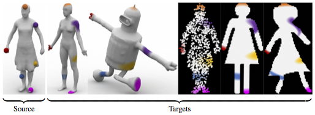

Matlab code to reproduce the results of the paper

J. Solomon, G. Peyré, V. Kim, S. Sra. [Entropic Metric Alignment for Correspondence Problems](https://hal.archives-ouvertes.fr/hal-01305808). ACM Transactions on Graphics (Proc. SIGGRAPH 2016), 35(4), pp. 72:1–72:13, 2016

To replicate the figures in the paper, a data/ directory is needed as well.  This directory is not included in the repository to avoid accidentally sharing proprietary data; contact [Justin Solomon](jsolomon@mit.edu) for access.

Copyright (c) 2016 Justin Solmon et al.
